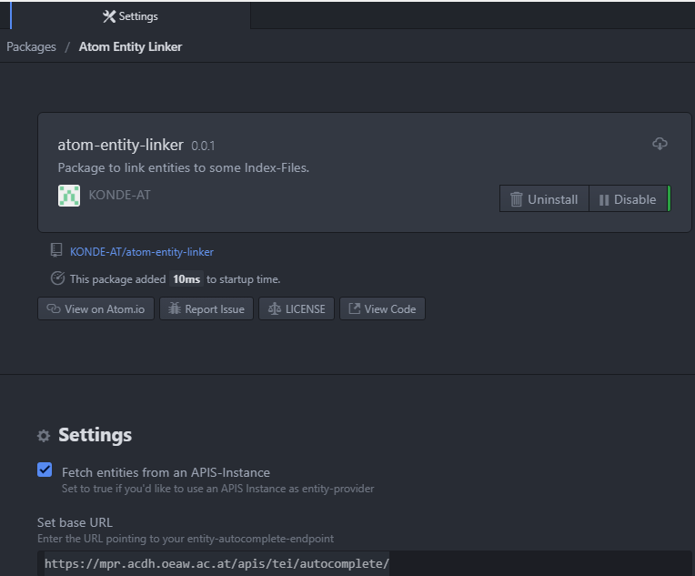

# atom-entity-linker

An Atom plugin providing autocomplete functions for tagging entities with `tei:rs` tags and `@ref` pointing to the entities' `@xml:id`.

The autocomplete will be triggered after typing the following prefix

* `@pe` -> triggers AC for *persons*
* `@pl` -> triggers AC for *places*
* `@wo` -> triggers AC for *works*
* `@or` -> triggers AC for *organisations*

something like `@plWien` will be e.g. replaced through `<rs type='place' ref='#{idOfWien}'></rs>`

This plug in based on [atom-autocomplete-boilerplate](https://github.com/lonekorean/atom-autocomplete-boilerplate) package released under MIT License by Will Boyd. The following parts of this readme are taken from there.

## Setup with APIS-based MPR entity base

After installation (below), set the preferences of the plugin to "fetch entities from an APIS instance" and set base url to `https://mpr.acdh.oeaw.ac.at/apis/tei/autocomplete/`

## atom-autocomplete-boilerplate

Boilerplate package for creating your own custom autocomplete provider for Atom.

## Introduction

This package is **not meant to be used directly**. It's a sample package that you can build upon to quickly create a custom autocomplete plug-in for Atom.

This README contains only basic installation steps. For the full tutorial, **please read [Creating an Autocomplete Plug-In for Atom](http://codersblock.com/blog/creating-an-autocomplete-plug-in-for-atom/)**.

## Installation

Atom provides a built-in way to download and install packages, but for local development, you'll want to do it this way.

1. Clone this repo.
2. Make sure you have apm installed.
    - On Mac, you might need to start Atom and go to Atom &gt; Install Shell Commands.
    - On Windows, it's probably already there.
3. Open your terminal, navigate into the repo directory, then run `apm link`.
4. Back in Atom, you should now see atom-<del>autocomplete-boilerplate</del><ins>entity-linker</ins> installed.
    - On Mac, you'll find it under Atom &gt; Preferences... &gt; Packages &gt; Community Packages.
    - On Windows, you'll find it under File &gt; Settings &gt; Packages &gt; Community Packages.

Don't forget to reload Atom when you make changes!
- On Mac, hit `ctrl` + `option` + `command` + `L`.
- On Windows, hit `ctrl` + `shift` + `F5`.

BASE-URL for APIS: https://{mydomain}/apis/tei/autocomplete/

